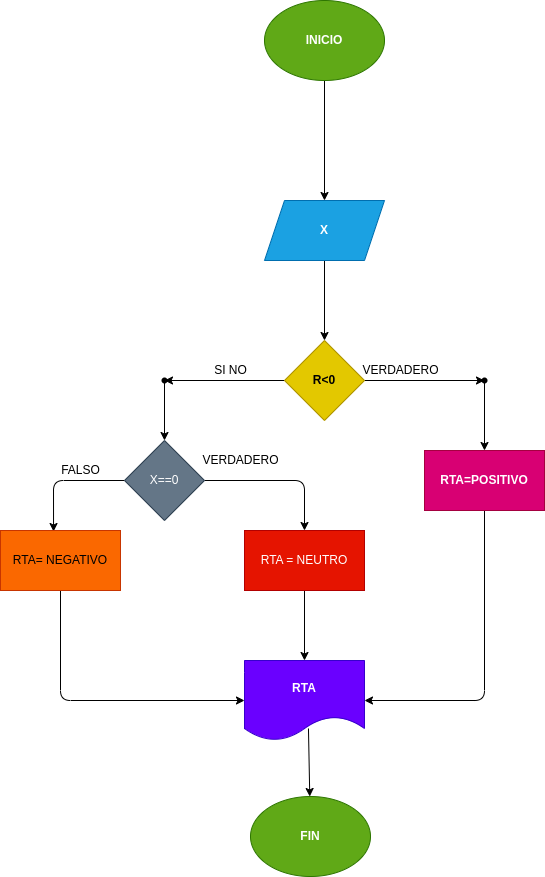

# Positivo Negativo
## programa para verificar si un numero es positivo o negativo

# crear un programa para verificar si un numero par o impar
# analisis

-variables de entrada

X : numero ingresadp

-variables de salida

RTA : nos va a decir si es positivo o negativo

# DISEÑO

# CONSTRUCCION